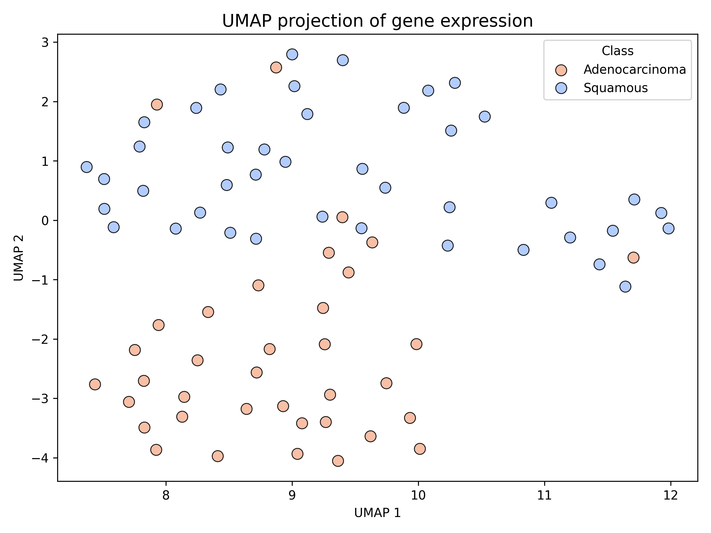
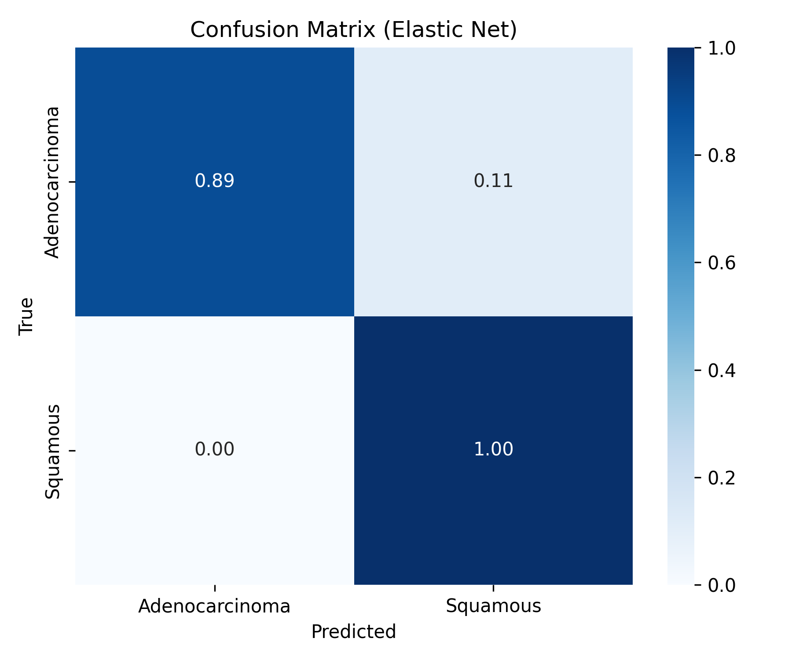
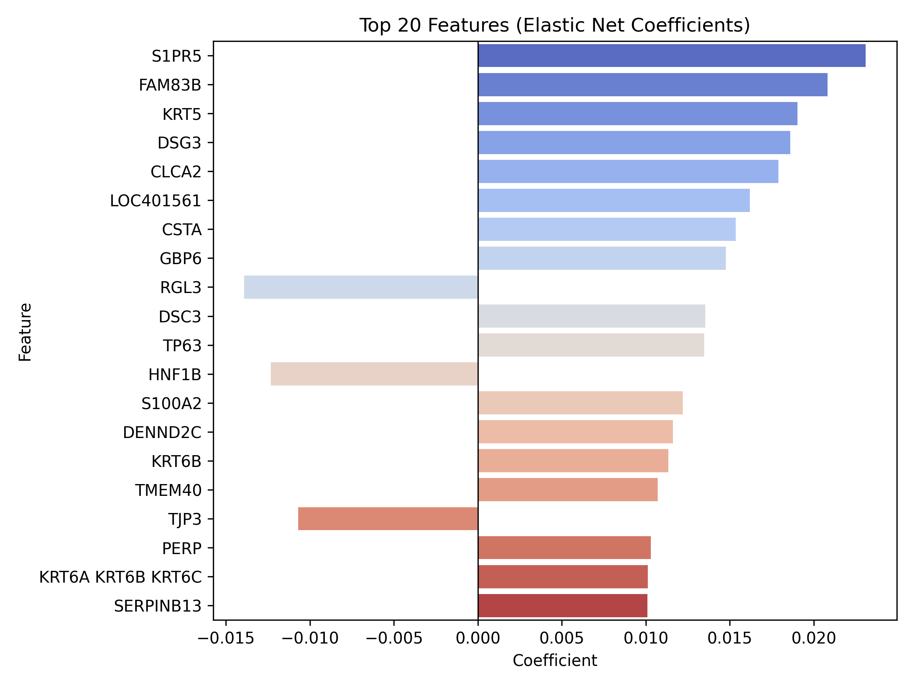
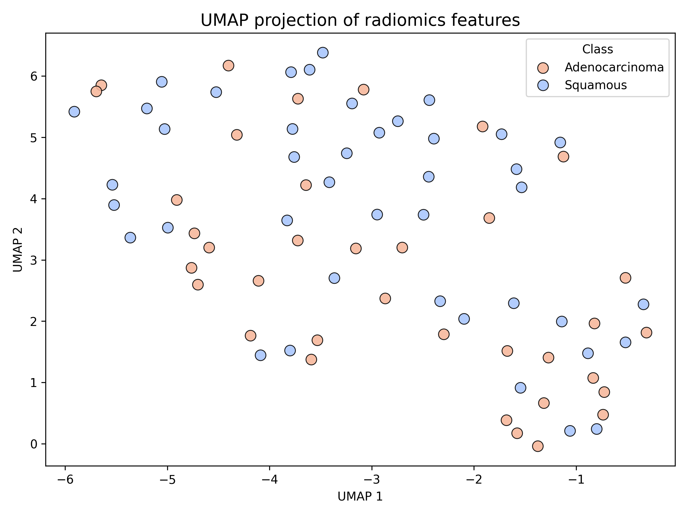
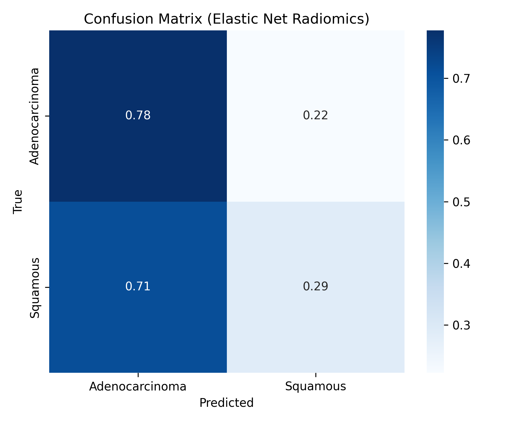
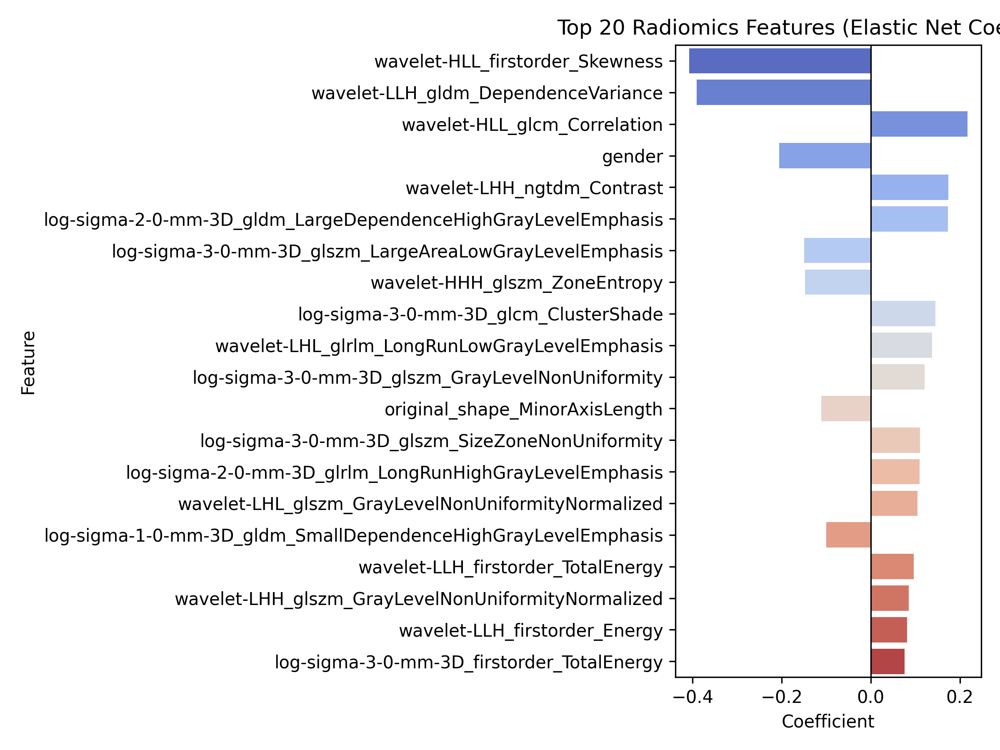
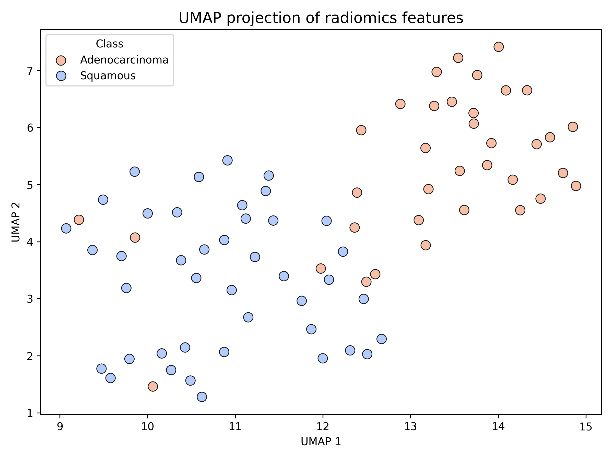
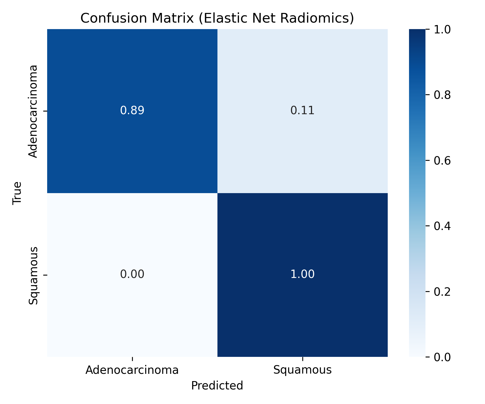

# NSCLC Radiogenomics with Deep Learning


[](https://doi.org/10.7937/K9/TCIA.2018.abcd1234)

This repository contains a deep learning workflow for integrating **CT imaging (radiomics)** and **transcriptomic data** to study **Non-Small Cell Lung Cancer (NSCLC)**. 
The objective is to classify tumors (e.g., Adenocarcinoma vs. Squamous Cell Carcinoma) by combining imaging-derived radiomic features with molecular data, enabling multi-modal radiogenomic analysis.

---

## Project Structure

```
NSCLC-Radiogenomics-deep-learning/
│
├── config/                    # Configuration files
│   └── radiomics_params.yaml  # Standardized radiomics extraction settings
│
├── data/                      # Raw and processed datasets
│   ├── raw/                   # Original data
│   │   ├── dicom/             # Raw CT scans in DICOM format
│   │   ├── metadata/          # Metadata files
│   │   └── omics/             # Gene expression CEL files
│   └── processed/             # Preprocessed datasets for ML
│       ├── masks/             # Segmentation masks
│       ├── nifti/             # CT scans converted to NIfTI
│       └── segmentation/      # Tumor segmentation outputs
│
├── env/                       # Python virtual environment (not tracked in git)
│
├── models/                    # Saved models
│
├── results/                   # Model outputs, features, figures, logs
│   ├── figures/               # High resolution workflow and result images
│   │   ├── elasticnet_confusion.png
│   │   ├── elasticnet_roc.png
│   │   ├── elasticnet_top_features.png
│   │   ├── multimodal_elasticnet_confusion.png
│   │   ├── multimodal_elasticnet_roc.png
│   │   ├── multimodal_elasticnet_top_features.png
│   │   ├── radiomics_elasticnet_confusion.png
│   │   ├── radiomics_elasticnet_roc.png
│   │   ├── radiomics_elasticnet_top_features.png
│   │   ├── tsne_gene_expression.png
│   │   ├── tsne_multimodal.png
│   │   ├── tsne_radiomics.png
│   │   ├── umap_gene_expression.png
│   │   ├── umap_multimodal.png
│   │   └── umap_radiomics.png
│   ├── radiomics_features.csv
│   ├── radiomics_features_dedup.csv
│   ├── logs/
│   └── models/
│
├── src/                       
│   ├── 01_preprocess_gene_expression_data.py
│   ├── 02_gene_expression_tsne_umap.py
│   ├── 03_gene_expression_elasticnet.py
│   ├── 04_preprocess_ctscan_data.py
│   ├── 05_extract_radiomic_features.py
│   ├── 06_radiomics_tsne_umap.py
│   ├── 07_radiomics_elasticnet.py
│   ├── 08_multimodal_tsne_umap.py
│   ├── 09_multimodal_elasticnet.py
│   └── utils/                 # Helper functions
│
├── requirements.txt           # Python dependencies
└── README.md                  # Project documentation
```

---

## Dataset

- **CT Scans**: [NSCLC-Radiogenomics Data (TCIA)](https://www.cancerimagingarchive.net/collection/nsclc-radiogenomics/)  
- **Transcriptomics**: Affymetrix microarray gene expression (CEL files available at TCIA dataset page).  
- **Annotations**: Histology labels (Adenocarcinoma, Squamous Cell Carcinoma, others).

---

## Workflow

The project follows a modular workflow:

1. **Data Download & Organization**  
   - Retrieve CT scans, masks (if available), and gene expression data from TCIA.  
   - Organize into patient-specific folders.

2. **Preprocessing**  
   - Convert DICOM to NIfTI.  
   - Resample to isotropic spacing (1×1×1 mm).  
   - Normalize intensities.  
   - Handle missing slices/patients.

3. **Segmentation**  
   - Automated tumor segmentation using pretrained **nnU-Net / TotalSegmentator**.  
   - Save binary tumor masks per patient.  
   - (Optional) Vessel segmentation for vessel-based radiomics.

4. **Radiomics Extraction**  
   - Apply [PyRadiomics](https://pyradiomics.readthedocs.io/) with standardized parameters (`config/radiomics_params.yaml`).  
   - Extract features: first-order, shape, texture (GLCM, GLRLM, GLSZM, NGTDM).  
   - Validate extracted features (e.g., count consistency).

5. **Omics Preprocessing**  
   - Normalize gene expression (RMA or quantile normalization).  
   - Filter genes (variance thresholding, pathway selection).  
   - Align with imaging patient IDs.

6. **Modeling (Elastic Net Baseline)**  
   - **Unimodal Models**:  
     - Elastic Net regression on radiomics only.  
     - Elastic Net regression on transcriptomics only.  
   - **Multimodal Models**:  
     - Elastic Net regression on combined features.  
   - Dimensionality reduction (t-SNE, UMAP) for visualization.

7. **Evaluation**  
   - Metrics: Accuracy, ROC-AUC, Precision/Recall.  
   - Confusion matrices and top features analysis.  
   - Cross-validation.  

8. **Visualization**  
   - High resolution workflow diagrams.  
   - UMAP/t-SNE plots for feature distributions.  
   - ROC curves, top features, and confusion matrices.

---

## Results

### Gene Expression
- **UMAP**
  
- **Confusion Matrix**
  
- **Top Features (Elastic Net)**
  

### Radiomics
- **UMAP**
  
- **Confusion Matrix**
  

  > **Note:** Tumor-specific segmentation masks are not available for this dataset.  
  > We are using non-specific "lung_nodules" masks.  
  > The performance of radiomic features is expected to improve if tumor-specific masks are applied.

- **Top Features (Elastic Net)**
  

### Multimodal (Radiomics + Gene Expression)
- **UMAP**
  
- **Confusion Matrix**
  

---

## Notes: Future Improvements

- Incorporate **CNNs on raw CT scans** (currently the dataset is not big enough for training a CNN).  
- Extend to **multi-class classification** (beyond binary Adeno vs Squamous).  
- Add explainability modules (SHAP, Grad-CAM).

---

## Acknowledgements

- **Dataset**: NSCLC Radiogenomics (The Cancer Imaging Archive, TCIA).  
- Citation: Bakr S, et al. "Data Descriptor: A radiogenomics dataset of non-small cell lung cancer." *Scientific Data* 2018.  
- Tools: PyRadiomics, nnU-Net, TotalSegmentator, scikit-learn, PyTorch/TensorFlow.

---
